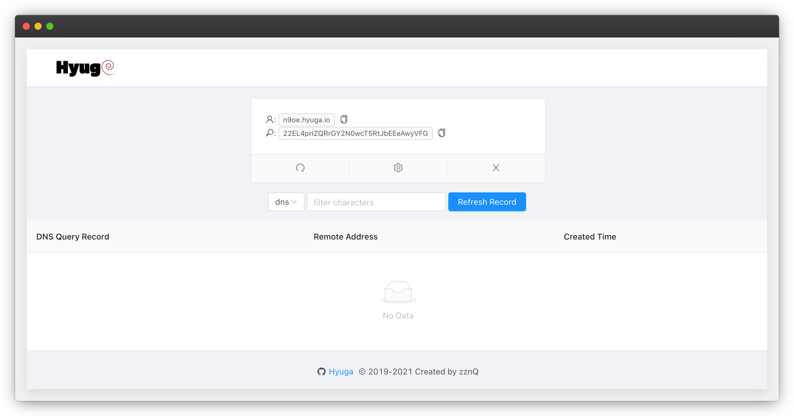

    

    
    
    
    
 

⚡️Hyuga 是一个用来检测带外(Out-of-Band)流量(DNS查询和HTTP请求)的监控工具。

---
## 🎉 项目简介
> `Hyuga` 的名字来自《火影忍者》中的日向一族的名称。

**通知📣!!!**
> 用 golang 重写了此项目，但保留之前的 [Python](https://github.com/Buzz2d0/Hyuga/tree/python) 版本。
> 参考了 [DNSLog.cn](http://dnslog.cn/) 平台, 丢弃了一些冗余的功能，保留查询 API。

项目地址：https://github.com/Buzz2d0/Hyuga

DEMO 主页：http://hyuga.co/

## 📷 预览

## 👏 主要框架

- [echo](https://github.com/labstack/echo/)
- [redis](https://github.com/go-redis/redis/)
- [dns](https://github.com/miekg/dns/)
- [Vue.js](https://cn.vuejs.org)

## 📝 更新日志

Hyuga使用[SemVer](https://semver.org/)语言化版本格式进行版本管理，你可以阅读[更新日志](./CHANGELOG.md)了解历史更新情况。

## ⌛ 未来计划

 - [x] 前端重构
 - [ ] 增加其他好用的小工具

## 🙏 致谢

- [DNSLog](http://dnslog.cn)：旧版前端样式借鉴
- [PockyRayzz](https://github.com/PockyRayzz)：使用 Vue 重构前端