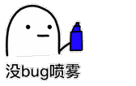

> Hyuga 名字来源：日向一族是火影忍者中的火之国木叶忍者村的一个氏族，日向一族拥有血继限界白眼。
> 与 `ceye.io` 相似，只因兴趣使然决定写出这款工具将其开源。

## Usage
> 访问：http://hyuga.co/

### Hyuga API

`http://api.hyuga.co/v1/records?token=`{token}`&type=`{dns | http}`&filter=`{filter}
- `token`: your hyuga api token.
- `type`: type of query, 'dns' or 'http'.
- `filter`: match url name rule, the filter max length is 20.
---

## Deploy
> 部署文档：[deploy.md](./docs/deploy.md)

## APIS
>  API 文档：[apis/](./docs/apis/)

---

### 参考

- [DNSLog](https://github.com/BugScanTeam/DNSLog)
- [ceye.io](http://ceye.io)

**附上神器**

